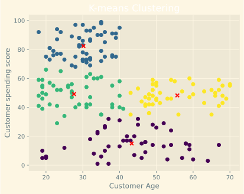
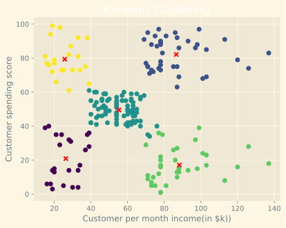

# Mall Customer Segmentation

This project use to predict temperature in indonesia on spesific month and year

## Install

This project requires **Python, jupyter notebook installed** and the following Python libraries installed:

- [NumPy](http://www.numpy.org/)
- [Pandas](http://pandas.pydata.org/)
- [seaborn](https://seaborn.pydata.org/)
- [matplotlib](http://matplotlib.org/)
- [scikit-learn](http://scikit-learn.org/stable/)

## Usage

first, you can clone this git repository

```
git clone https://github.com/HillalXD/customer-segmentation.git
```

then navigate your command to this directory

```
cd customer-segmentation
```

after that run `knn.ipynb` to see customer segment
```
jupyter notebook knn.ipynb
```


## Code 
- Template code is provided in the `knn.ipynb` notebook file.
- `Mall_Customers.csv` in provide data source for training model


## Clustering result

customer age segment


customer income segment



